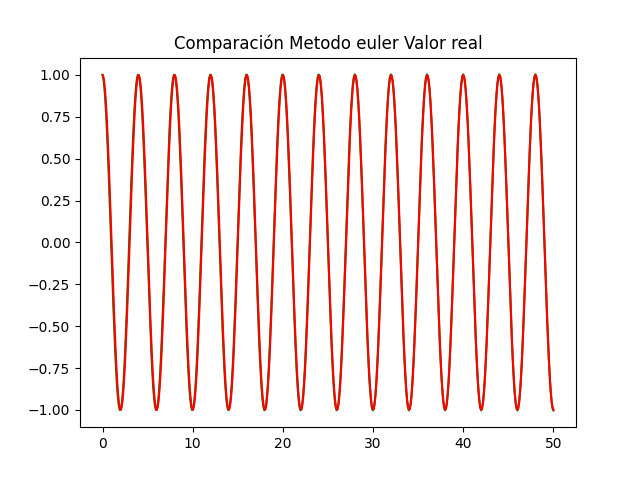
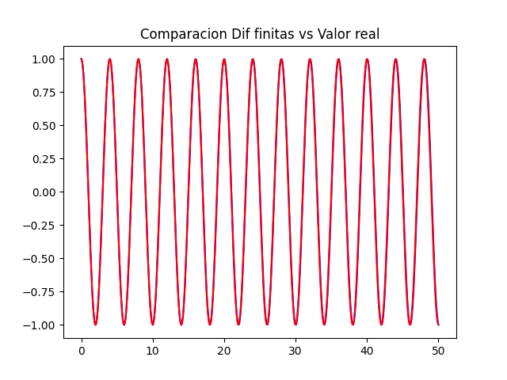
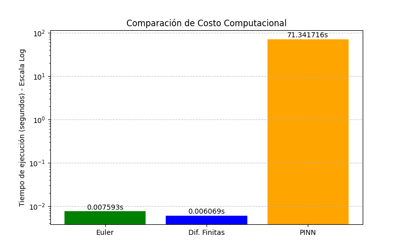
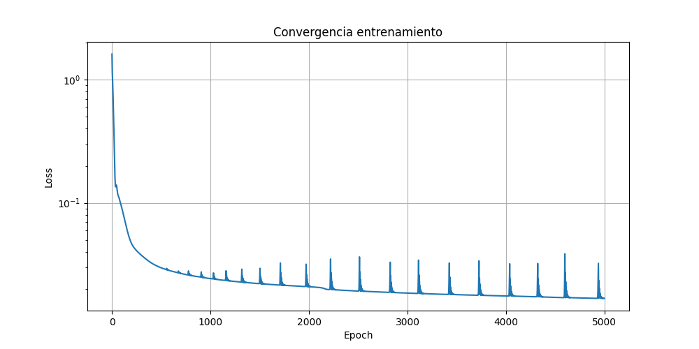
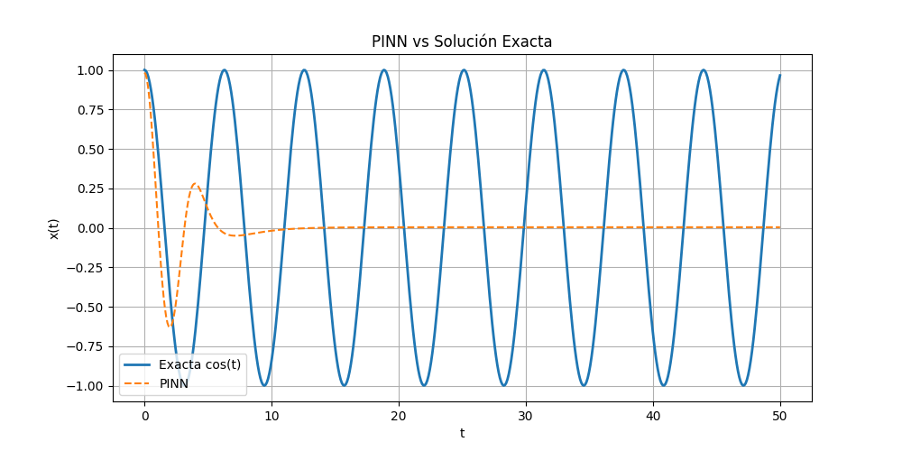
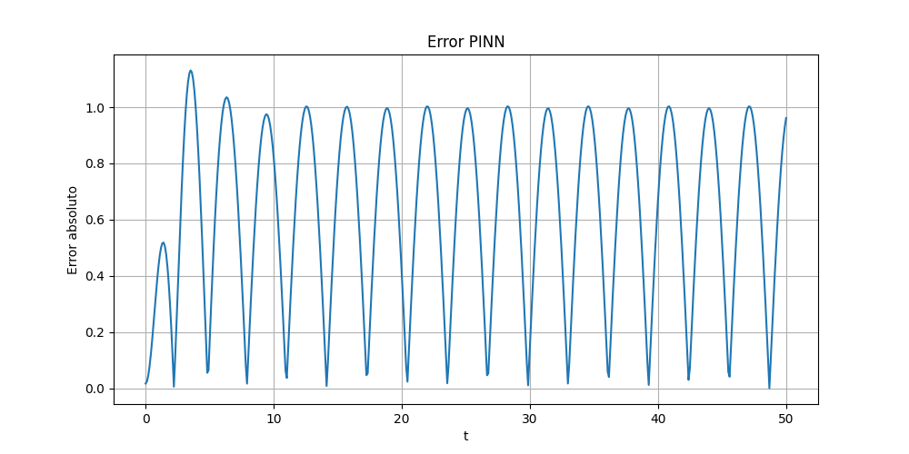

# Resolución de Ecuaciones Diferenciales con PINNs vs Métodos Clásicos

[cite_start]Este repositorio contiene la implementación del proyecto de investigación y validación empírica desarrollado para la asignatura **MAT-274: Análisis Numérico II** en la **Universidad Técnica Federico Santa María**.

[cite_start]El estudio evalúa, analiza y contrasta el rendimiento del método de aproximación funcional basado en Redes Neuronales Informadas por la Física (**PINNs**) frente a esquemas numéricos tradicionales de discretización temporal[cite: 337].

---

## Descripción del Problema

[cite_start]Se aborda el problema de valor inicial (PVI) para un **oscilador armónico simple**, un fenómeno físico de movimiento conservativo en un horizonte de tiempo $t \in [0, T]$ regido por la siguiente ecuación diferencial ordinaria (EDO) de segundo orden[cite: 335, 336]:

$$\frac{d^2x}{dt^2} + \omega^2x = 0$$

[cite_start]Sujeto a las condiciones iniciales autónomas de desplazamiento y velocidad[cite: 336]:

$$x(0) = x_0 = 1, \quad \left.\frac{dx}{dt}\right|_{t=0} = v(0) = v_0 = 0$$

[cite_start]Donde $\omega$ representa la frecuencia angular del sistema, fijada en $\frac{\pi}{2}$[cite: 336]. [cite_start]Este sistema dinámico lineal posee una solución analítica exacta y única dada por:

$$x(t) = \cos(\omega t)$$

---

## Métodos Implementados

[cite_start]Para los esquemas clásicos, el problema de segundo orden se reformula como un sistema acoplado de primer orden mediante el cambio de variable lineal $v(t) = \frac{dx}{dt}$[cite: 338]:

$$(1)\quad \begin{cases} \frac{dx}{dt} = v(t) \\ \frac{dv}{dt} = -\omega^2x(t) \\ x(0) = 1 \\ v(0) = 0 \end{cases}$$

### 1. Métodos Numéricos Tradicionales

<b>Método de Euler Simpléctico</b>

[cite_start]Definiendo un paso de tiempo constante $h > 0$ tal que $t_n = nh$, se aplica el esquema de Euler que actualiza de forma implícita la velocidad en el paso temporal, preservando la estructura hamiltoniana y conservativa del sistema[cite: 339, 340, 341]:

$$v_{n+1} = v_n - h\omega^2x_n$$
$$x_{n+1} = x_n + hv_{n+1}$$

<b>Diferencias Finitas Centradas</b>

[cite_start]Se aproxima el operador diferencial mediante una diferencia central en la malla temporal[cite: 341]:

$$\frac{d^2x}{dt^2}(t_n) \approx \frac{x_{n+1} - 2x_n + x_{n-1}}{h^2}$$

[cite_start]Sustituyendo en la EDO se obtiene la ecuación en diferencias recursiva[cite: 341]:

$$x_{n+1} = (2 - \omega^2h^2)x_n - x_{n-1}$$

[cite_start]El nodo inicial rezagado $x_{-1}$ se aproxima por desarrollo de Taylor utilizando la velocidad inicial $v_0 = 0$, resultando[cite: 341, 342]:

$$x_1 = x_0 - \frac{1}{2}\omega^2h^2 x_0$$

### 2. Aproximación Funcional (PINN)

[cite_start]Se implementa un Perceptrón Multicapa (MLP) que define un mapeo continuo $\hat{x}(t; \theta):\mathbb{R} \rightarrow \mathbb{R}$ parametrizado por el espacio $\theta = \{W_\ell, \vec{b}_\ell\}_{\ell=1}^L$ con $L=4$ capas[cite: 351, 352, 354]:
* [cite_start]**Capa de entrada ($\ell = 1$):** $W_1 \in \mathbb{R}^{32 \times 1}$ y $\vec{b}_1 \in \mathbb{R}^{32}$[cite: 354].
* [cite_start]**Capas ocultas ($\ell = 2, 3$):** $W_\ell \in \mathbb{R}^{32 \times 32}$ y $\vec{b}_\ell \in \mathbb{R}^{32}$ acopladas mediante la función de activación Tangente Hiperbólica ($\sigma = \tanh \in C^\infty$)[cite: 354, 356].
* [cite_start]**Capa de salida ($\ell = 4$):** $W_4 \in \mathbb{R}^{1 \times 32}$ y $b_4 \in \mathbb{R}$ lineal para evitar acotar arbitrariamente el rango de la solución[cite: 354, 355].

[cite_start]El entrenamiento transforma la EDO en un problema de optimización mediante la minimización del funcional de pérdida compuesto por diferenciación automática[cite: 359, 360]:

$$Loss(\theta) = Loss_{fisica}(\theta) + Loss_{Cond.Ini}(\theta)$$

$$Loss_{fisica}(\theta) = \frac{1}{N} \sum_{i=1}^{N} \left| \frac{d^2\hat x}{dt^2}(t_i; \theta) + \omega^2 \hat{x}(t_i; \theta) \right|^2$$

$$Loss_{Cond.Ini}(\theta) = (\hat{x}(0; \theta) - 1.0)^2 + \left( \frac{d\hat{x}}(0; \theta) - 0.0 \right)^2$$

---

## 🔬 Análisis y Resultados Cuantitativos

[cite_start]Los estadísticos numéricos derivados del procesamiento de las simulaciones en un horizonte extendido de largo plazo ($T = 50$, $N = 500$ nodos, paso $h = 0.1$) arrojaron las siguientes métricas frente a la solución analítica exacta[cite: 406, 408, 418]:

| Métrica / Esquema | Euler Simpléctico | Diferencias Finitas | PINN (Adam, 5000 épocas) |
| :--- | :---: | :---: | :---: |
| **Tiempo de Cómputo (s)** | $0.007593$ | $0.006069$ | $71.341716$ |
| **Error Máximo ($L_{\infty}$)** | $0.07725$ | $0.07725$ | $1.13093$ |
| **Error Global ($L_2$)** | $0.03267$ | $0.03267$ | $0.69836$ |

### Visualización de las Simulaciones
*(Nota: Guarda tus gráficos en una carpeta llamada `plots/` dentro de tu repositorio para que se rendericen automáticamente aquí)*

#### 1. Precisión Local de las Soluciones Clásicas
[cite_start]Las mallas discretas mapean con total precisión las amplitudes unitarias periódicas reales y preservan de forma acotada la energía en horizontes extensos[cite: 421].

*Figura 1: Trayectoria numérica de la aproximación por Euler simpléctico frente a la solución exacta.*

*Figura 2: Aproximación recursiva del esquema de Diferencias Finitas centradas frente al valor analítico.*

#### 2. Evaluación de Costo Temporal
[cite_start]Se evidencia una diferencia de **cuatro órdenes de magnitud** en escala logarítmica debido al cálculo iterativo de los grafos de retropropagación por cada época en la PINN[cite: 422, 423].

*Figura 3: Comparación de costo computacional total medido en segundos (Escala Logarítmica).*

#### 3. Fenómeno de Colapso Catastrófico en PINNs
[cite_start]El entrenamiento funcional expone un comportamiento errático debido a la no-convexidad del paisaje de pérdida[cite: 424]. [cite_start]La PINN queda atrapada en un mínimo local y **colapsa catastróficamente pasados los primeros $t = 5$ segundos**, amortiguándose por completo hacia una línea asintótica trivial[cite: 425, 426].

*Figura 4: Evolución histórica del funcional de pérdida compuesto bajo escala logarítmica.*

*Figura 5: Colapso asintótico de la trayectoria aproximada por la PINN frente a la oscilación física real.*

*Figura 6: Error absoluto de aproximación temporal exhibido por la red neuronal informada.*

#### 4. Estudio Numérico de Sensibilidad Inicial
[cite_start]Al alterar el dato inicial $x_0 \in \{0.8, 1.0, 1.2\}$, los métodos clásicos se propagan de manera acotada[cite: 428, 429, 430]. [cite_start]Por el contrario, la PINN muestra una inestabilidad severa gatillada por la patología matemática del **stiffness de gradientes**[cite: 430, 431]:

$$\|\nabla_{\theta} Loss_{fisica}(\theta)\| \gg \|\nabla_{\theta} Loss_{Cond.Ini}(\theta)\|$$

[cite_start]El optimizador Adam privilegia anular el residuo global de la EDO postergando el ajuste en el origen ($t=0$), quebrando el principio de causalidad temporal y convergiendo a trayectorias que violan el dato inicial real[cite: 414, 432, 433].

*Figura 7: Análisis comparativo de la sensibilidad del error absoluto bajo alteraciones controladas del dato inicial $x_0$.*

---

## Conclusiones de Validación Teórica

* [cite_start]**Dominio de Métodos Clásicos:** Para EDOs lineales y conservativas simples, los esquemas tradicionales entregan precisiones rigurosas de manera instantánea[cite: 435, 436].
* [cite_start]**Falla de Causalidad en PINNs:** Resolver simultáneamente todos los estadios del dominio continuo destruye la causalidad temporal natural del fenómeno físico[cite: 436, 437].
* [cite_start]**Ámbito de Aplicación Real:** Las PINNs no son útiles para competir frente a métodos tradicionales en problemas elípticos o lineales simples de baja dimensionalidad, sino en escenarios de **descubrimiento de leyes físicas (SciML) y resolución de problemas inversos acoplados multidimensionales**[cite: 438].

## 📚 Referencias
* [1] Savović, S., Ivanović, M. R., and Min, R. (2023). *A Comparative Study of the Explicit Finite Difference Method and Physics-Informed Neural Networks for Solving the Burgers' Equation*. Axioms, vol. 12, no. [cite_start]10, 982[cite: 439, 440].
* [2] Wang, S., Sankaran, S., Wang, H., and Perdikaris, P. (2023). [cite_start]*An Expert's Guide to Training Physics-Informed Neural Networks*. arXiv preprint arXiv:2304.08289[cite: 440, 441].
